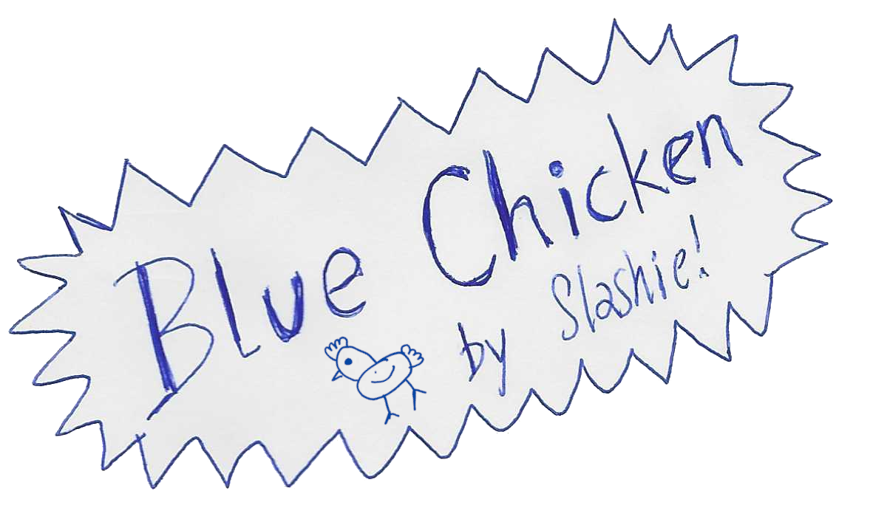
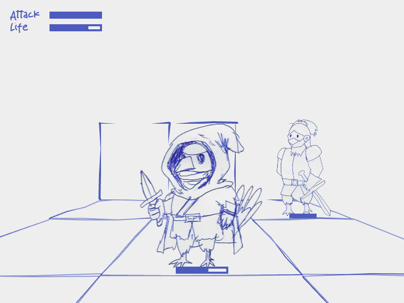

 

  
  <h3 align="center">Blue Chicken</h3>
  

    A retro hand-drawn speed dungeon-crawler
     
     
    <a href="https://github.com/othneildrew/Best-README-Template">Play Online</a>
  

<!-- TABLE OF CONTENTS -->

  
Table of Contents

  <ol>
    <li>
      <a href="#about-the-project">About The Project</a>
      <ul>
        <li><a href="#built-with">Built With</a></li>
      </ul>
    </li>
    <li>
      <a href="#development">Development</a>
    </li>
    <li><a href="#contributing">Contributing</a></li>
    <li><a href="#license">License</a></li>
    <li><a href="#contact">Contact</a></li>
  </ol>

## About The Project

  

Blue Chicken is a very traditional first person dungeon crawler: Your mission is to find the blue chicken who
is at the end of a sequence of rooms that gets rearranged every time you play; in these rooms you’ll have to
solve puzzles and fight your way through, as you find magical artifacts that make you powerful.

This is a speed dungeon crawler where the goal is to finish as quick as possible!

(<a href="#readme-top">back to top</a>)

### Built With

http://phaser.io/

(<a href="#readme-top">back to top</a>)

## Development

The project is provided in a very simplified form; there is no building process, the contents of the `web` directory
are ready to be served, and comprise the source code of the game itself.

(<a href="#readme-top">back to top</a>)

## Contributing

Contributions are what make the open source community such an amazing place to learn, inspire, and create. Any contributions you make are **greatly appreciated**.

If you have a suggestion that would make this better, please fork the repo and create a pull request. You can also simply open an issue with the tag "enhancement".
Don't forget to give the project a star! Thanks again!

1. Fork the Project
2. Create your Feature Branch (`git checkout -b feature/AmazingFeature`)
3. Commit your Changes (`git commit -m 'Add some AmazingFeature'`)
4. Push to the Branch (`git push origin feature/AmazingFeature`)
5. Open a Pull Request

(<a href="#readme-top">back to top</a>)

<!-- LICENSE -->
## License

Distributed under the GNU GPL v3 License. See `LICENSE.txt` for more information.

(<a href="#readme-top">back to top</a>)

<!-- CONTACT -->
## Contact

slashie - [slashie.net](https://slashie.net)

(<a href="#readme-top">back to top</a>)

